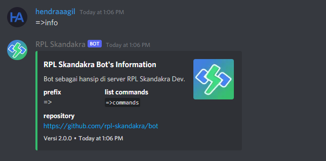

# RPL Skandakra Bot

Bot for help moderation in RPL Skandakra Discord Server.

## Features

Node.js `>=22.x` is required for discord.js v13.

- Add role after member introduce
- Send good bye message
- Send welcome message

Available [commands](commands/slash):

- [x] clear
- [x] info
- [x] ping
- [x] qr
- [x] server
- [x] sholat

## License

This project is under [MIT License](LICENSE).
